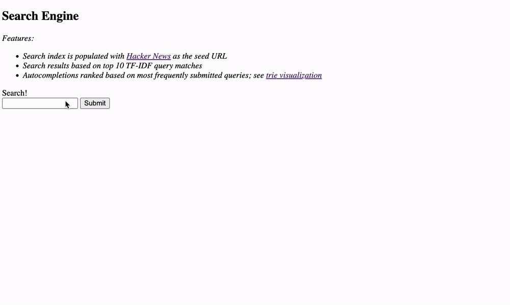

# Search Engine
[](https://github.com/mweiden/autocomplete/actions/workflows/python-package.yml)



This is a single-node toy/demonstration of a search engine distributed system.

Components:
- Web Server
  - serves a simple html page with search input text box
  - on submit the query is logged to an analytics log and the top 10 search results ranked by TF-IDF are returned
- Analytics cron job 
  - reads the analytics log and constructs a Trie with caching to serve autocomplete suggestions
- Web Crawler cron job
  - Builds an Inverted Index from scraped web pages starting with [Hacker News](https://news.ycombinator.com) as a seed url


## Running

Prerequisites for running:

* make
* Docker
* A web browser

To run the application

1. `make build`
1. `docker-compose up`
1. Open a browser to `localhost:3000`
1. Start submitting queries
1. If you want to refresh the search index, run `make inverted_index`

Note: the autosuggest trie is refreshed every 30 seconds.

## Development

Prerequisites for developing:

* Python/Pip

Create a virtual environment

```
python -m venv .venv
```

Install requirements

```
make install
```

Run tests

```
make test
```

## TODO

* Move the web crawler cron job to docker-compose: unfortunately Selenium web_driver is currently [not supported](https://github.com/SeleniumHQ/selenium/issues/12651#issuecomment-1734785707) in the docker environment, so you'll have refresh the index yourself